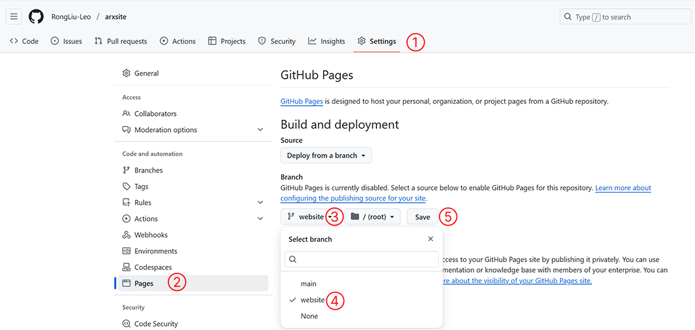

<p align="center">
  
</p>

<p align="center">
  <a href="https://pypi.org/project/arxsite/">
    
  </a>
  <a href="https://github.com/RongLiu-Leo/ArxSite/blob/main/LICENSE">
    
  </a>
  <a href="https://github.com/RongLiu-Leo/ArxSite/pulls">
    
  </a>
  <a href="https://github.com/RongLiu-Leo/ArxSite/stargazers">
    
  </a>

</p>

<p align="center">
    Effortlessly turn any arXiv paper into a stylish GitHub Pages website.
</p>

---

## ✨ Features
- 🔍 Auto-fetches metadata (title, authors, abstract) from an arXiv paper
- 🌐 Instantly generates a stylish website using Jekyll templates
- 🎨 Supports customizable themes
- 📦 One-liner install and run


## 🚀 Installation
Install ArxSite from PyPI:
```bash
pip install arxsite
```


## 🛠️ Usage
```bash
arxsite <arxiv_url> [--style <style_name>]

Options:
  --style, -s     Choose a website style (default: default)
  --help, -h      Show this help message and exit
```


## 🖼️ Available Website Styles

<details>
<summary><strong>Click to view styles</strong></summary>

### default
A simple template rushed by [Rong](https://github.com/RongLiu-Leo).

### Your Style (Coming Soon?)
Your custom style is always welcome!
Feel free to contribute your own template and tell us a fun fact about yourself, your theme, or your design process.
</details>


## ⚡ Quick Guide
<details>
<summary><strong>Click to view guides</strong></summary>
### 1. Navigate to your GitHub project root folder
```bash
cd <Your GitHub Project Root>
```

### 2. Create and switch to a new empty branch called `website`
```bash
git checkout --orphan website
git rm -rf .  # Remove all tracked files from index
```

### 3. Run `arxsite` with your arXiv paper URL
```bash
arxsite https://arxiv.org/abs/2501.18630
```

📦 Sample Output:
```
🔍 Fetching metadata from: https://arxiv.org/abs/2501.18630
title: Deformable Beta Splatting
authors: Rong Liu, Dylan Sun, Meida Chen, Yue Wang, Andrew Feng
🛠️ Generating Jekyll site with style 'default'...
🌐 Jekyll site generated at: test_path
✅ Website generated successfully!
```

### 4. Add, commit, and push the website branch
```bash
git add .
git commit -m "Initialize website from arxsite"
git push origin website
```

### 5. Set up GitHub Pages from the `website` branch  
Go to **Settings > Pages** and select the `website` branch as the source.

<p align="center">
  
</p>

### 6. 🎉 Visit your project website!
```bash
https://<Your GitHub Username>.github.io/<Repo Name>/
```
✅ Example: [https://rongliu-leo.github.io/ArxSite/](https://rongliu-leo.github.io/ArxSite/)
</details>


## 🙌 Contribute
Have a cool idea or style in mind?  
Pull requests are welcome! Help make ArxSite better for everyone.

